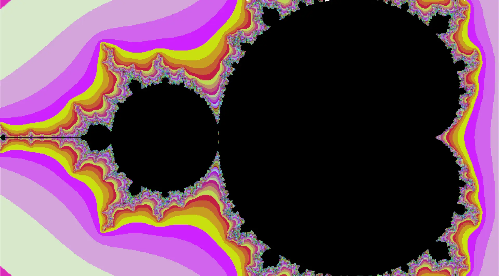
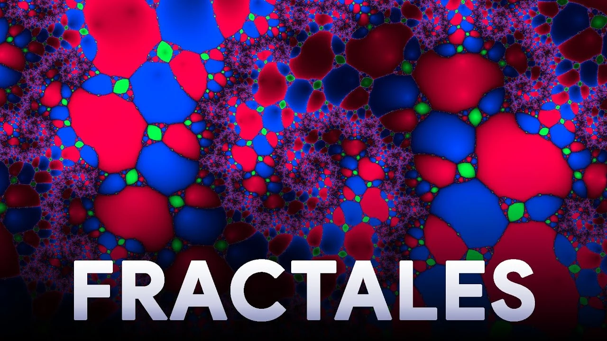
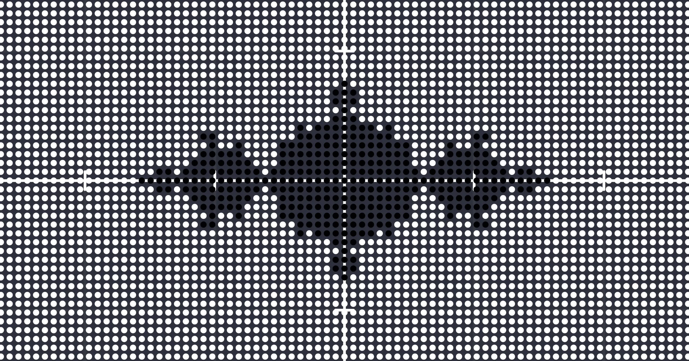
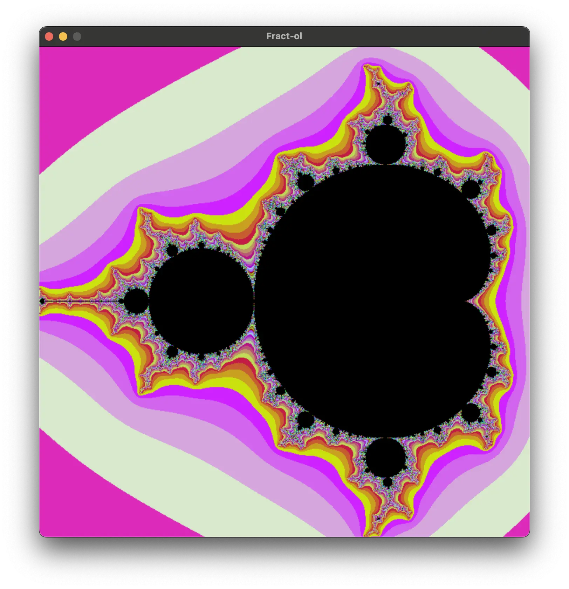
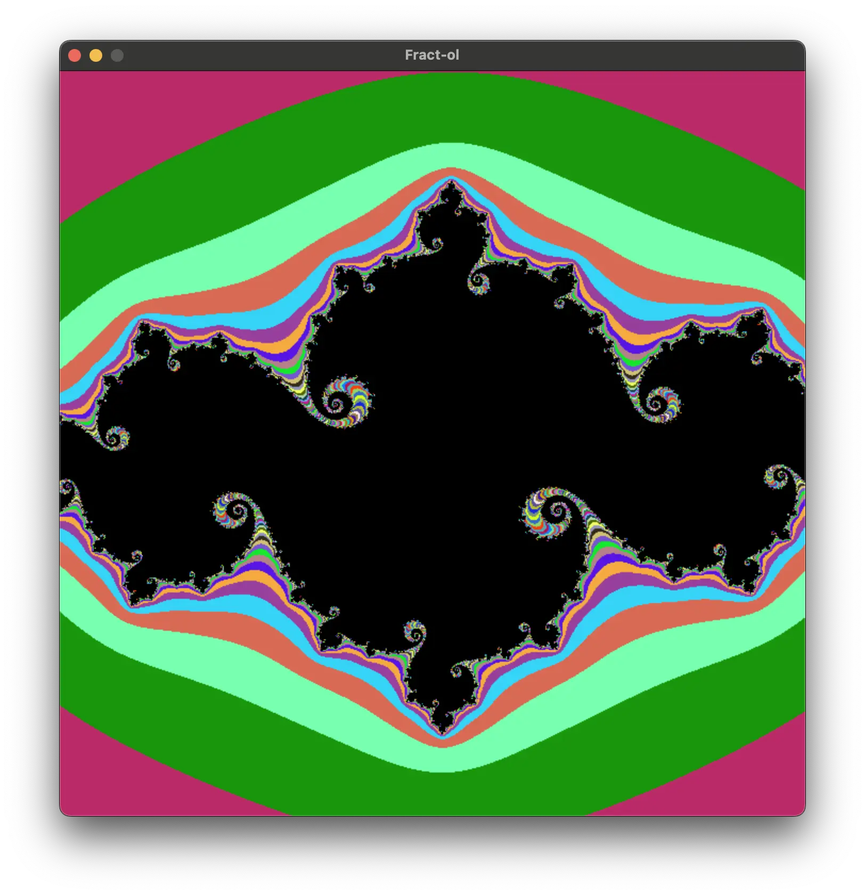
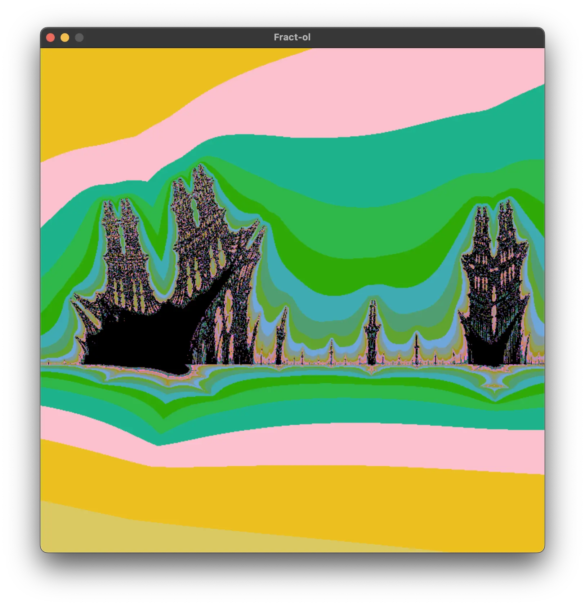

<div align="center">
	<h1>🌌 fract-ol</h1>
	
	<p><b>The <code>fract-ol</code> project from the 42 School is one of the three "beginner" graphical projects of the cursus. It teaches you about manipulating a low-level graphic library, advanced math, and more.</b></p>
	<p><em>⚠️ As mentioned in the rules of 42, do not copy and paste this code without thinking, the following README provides enough explanations and resources for you to go on your own journey with the awful MiniLibX ❤️</em></p>
	<a href="https://wakatime.com/badge/user/db0e5671-cec5-4e7b-9d41-19a881e67f7d/project/a74b4852-2740-4faa-8753-9239f87e3cdc">
		
	</a>
	<br />
	
	<a href="https://developer.apple.com/library/archive/documentation/Performance/Conceptual/ManagingMemory/Articles/FindingLeaks.html">
		
	</a>
	
	<br />
	
</div>

## 📖 Table of Contents
<!--ts-->
* [⚙️ Usage](#usage)
	* [🕹 Controls](#controls)
* [🤔 How to do Fract-ol?](#how-to-do-fract-ol)
	* [🤓 The math behind fractals](#the-math-behind-fractals)
	* [👨🏻‍💻 From math to code](#from-math-to-code)
* [🛠️ Main functions](#main-functions)
	* [`draw_fractal`](#draw_fractal)
	* [`calculate_mandelbrot`](#calculate_mandelbrot)
* [🌌 Demonstrations](#demonstrations)
	* [🍑 Mandelbrot](#mandelbrot)
	* [👩🏼 Julia](#julia)
	* [🔥 Burning Ship](#burning-ship)
* [🙇🏻 Resources and Credits](#resources-and-credits)
<!--te-->

## Usage

* **Clone** the repository

	```bash
	git clone https://github.com/leogaudin/fract-ol.git
	```

* To **compile** the program, run the following command

	```bash
	make
	```

* To **execute** the program, use the following command

	```bash
	./fractol <fractal>
	```

> Available commands: `mandel`, `julia`, `ship`

### Controls

The program supports the following controls:
<table align="center">
  <tr align="center">
    <td><b>Scroll</b></td>
    <td>Zoom</td>
  </tr>
  <tr align="center">
    <td><b>⬆️ ⬇️ ⬅️ ➡️</b></td>
    <td>Move the view</td>
  </tr>
  <tr align="center">
    <td><b>R</b></td>
    <td>Reset the fractal to its initial state</td>
  </tr>
  <tr align="center">
    <td><b>C</b></td>
    <td>Shift the color range</td>
  </tr>
  <tr align="center">
    <td><b>M</b> and <b>P</b></td>
    <td>Decrease or increase the max iterations</td>
  </tr>
  <tr align="center">
    <td><b>J</b></td>
    <td>Generate new constants for the Julia fractal</td>
  </tr>
</table>


> 🚀 The lower the  iterations, the faster the program will run.
>
> 🐢 The deeper the zoom, the more iterations are needed to render the fractal, the slower the program.

## How to do Fract-ol?

### The math behind fractals

Fractals are formed by mathematical suites.

For example, the Julia and Mandelbrot sets are defined by the following suite:

$$
z_{n+1} = z_n^2 + c
$$

Fractals are based on complex numbers (i.e. numbers with a real and imaginary part, like $z = a + bi$).

There is a great video by [DIMENSION CODE](https://www.youtube.com/@DIMENSIONCODE) explaining the concept of fractals and how to generate them here:

|[](https://youtu.be/wUlVFYJIUNA)|
|:-------:|
| **Comment Générer des Fractales ? ❄️** |
| *🇫🇷 French only*|

The video is ≈ 20 minutes long, but the part that we need to get started can be summarised as:

* The $a$ (real) part of the complex number is represented on a x-axis.
* The $b$ (imaginary) part of the complex number is represented on a y-axis.
* This means that the coordinates $(3, 7)$ represent number $z = 3 + 7i$, and that every pixel of a window can be used to represent a complex number.
* Every complex number put into the suite will either:

	* converge to a finite number
	* diverge to infinity.

* The pixels of the window can be colored depending on whether the complex number they represent converges or diverges.

* If we paint every pixel of the window in  if the complex number they represent converges or  if it diverges, we can see it already generates a fractal:

	||
	|:-------:|
	| *Screenshot from the video* |

### From math to code

1. Setup the MiniLibX library.
	* You can find good resources on how to do this [here](https://qst0.github.io/ft_libgfx/man_mlx.html).
2. Create a window, image and all the necessary things in the MiniLibX.
3. Iterate through every pixel of the window.
	* *See [`draw_fractal`](#draw_fractal)*.
4. For every pixel, calculate the complex number it represents and put it into the suite.
	* *See [`calculate_mandelbrot`](#calculate_mandelbrot) for example*.
5. If the suite diverges, color the pixel in .
6. If the suite converges, color the pixel in .


## Main functions

### `draw_fractal`

```c
int draw_fractal(t_fractal *fractal, char *query, double cx, double cy)
```
As explained before, this function simply iterates through the pixels of the window and calls the appropriate function to draw the fractal.

### `calculate_mandelbrot`

```c
void calculate_mandelbrot(t_fractal *fractal)
```
* The $z$ variables are set to 0, the beginning of the suite.

* The $c$ constants are set to the coordinates of the pixel.

* For performance reasons, we use the `(x * x)` calculation instead of the
`pow(x, 2)` function.

* The suite is iterated until:

	* **The absolute value of z is greater than the system's max values**: the suite will diverge to infinity.

	* **The number of iterations is too high**: the suite will stay stuck in an infinite loop.

* If the the suite diverges, we color it and multiply the color by the number of iterations to make the mathematical depths more clear to the
eye.

***🎉 Fun fact**: the British Standard subtitle color,  `#FCBE11` gives some pretty cool psychedelic renders when multiplied by the number of iterations*

> `calculate_julia` and `calculate_burning_ship` are very similar to `calculate_mandelbrot`, but with different equations.

## Demonstrations

### Mandelbrot

||
|:-------:|
| $z_{n+1} = z_n^2 + c$ |

### Julia

||
|:-------:|
| $c_{real} = -0.745429$ and $c_{imaginary} = 0.05$ |

### Burning Ship

||
|:-------:|
| $z_{n+1}=abs(z_n)^2+c$ |

## Resources and Credits

*The understanding of the concept of fractals and the implementation of the program was done with the help of the following resources.*

* **Mathematical principles, equations, and translation to code**

	* **Comment Générer des Fractales ?**: https://www.youtube.com/watch?v=wUlVFYJIUNA

* **Use of threads to improve performance** (not included here for the moment)

	* https://github.com/GlThibault/Fractol/

* **Draw pixels on image**

	> 💡 Don't use `mlx_pixel_put` like I did at first.
	>
	> It's slow and you can't re-render the canvas.
	>
	> Use `mlx_put_image_to_window` instead.
	* https://gontjarow.github.io/MiniLibX/mlx-tutorial-create-image.html

* **Explore more**
	* **Other fractals and equations**: https://fractalfoundation.org/OFC/OFC-5-5.html

